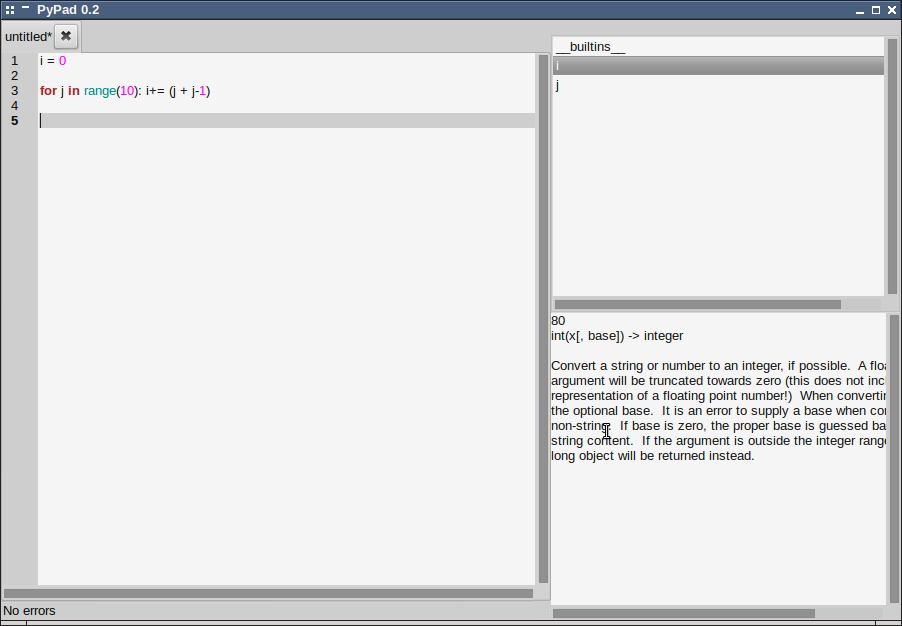

LivelyPy
====================
LivelyPy is a python text editor prototype to an auto-compile editor.

**Notice**: *This was an experimental project aimed at learning about GTK, multi-threading, stack frames, and of course, user interface/experience. It is not intended to be used as a Python editor.*

## Requirements:
+ gtksourceview2

Basic Usage
---------------------
## Running:
> python main.py

## Commands

### File Operations
+ New => Ctrl + N
+ Close => Ctrl + W
+ Save => Ctrl + S
+ Open => Ctrl + O

### Autocomplete
+ Select => Alt + Enter
+ Move Up => Alt + Up
+ Move Down => Alt + Down

### Evaluate
Evaluate selected text or cursor location
+ Ctrl + E
